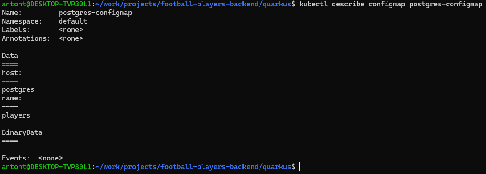

# Project Info 
- Language: Java 21
- BuildTool: Maven
- Framework: Quarkus
- Type: RestAPI
- Database: Postgres
- Docker for containerization
- Kubernetes for container orchestration
- Used WSL2 for development

# Cluster Info
- Using Minikube to run a local cluster.
- Using images from Docker Hub.
- Created 2 services (postgres & quarkus-api), 1 Configmap and 1 Secret. 

# SwaggerUI:
- localhost:8080/apis

## Docker: 
To build two services (docker-compose.yml) for postgres you can run: `docker compose up`
To build a image and push to DockerHub / Registry: 
- `mvn clean install`
- `docker build -f src/main/docker/Dockerfile.jvm -t football-players .`
- `docker tag football-players username/football-players:1.0`
- `docker push username/football-players:1.0`

## Minikube
- `minikube start --driver=docker` -> Start your cluster.
- `minikube status` -> Check status. 
- `minikube dashboard` -> Get some insights. 
- `minikube stop` -> Halt the cluster

## K8S
Useful tools
- `kubectx <context-name>` to switch context
- `kubens <namespace-name>` to switch namespaces

To create or update resources in the cluster (MiniKube): 
- `kubectl apply -f postgres-configmap.yaml`
- `kubectl apply -f postgres-credentials.yaml`
- `kubectl apply -f postgres-pv.yaml`
- `kubectl apply -f postgres-pvc.yaml`
- `kubectl apply -f postgres-deployment.yaml`
- `kubectl apply -f quarkus-deployment.yaml`

Remember to give Service account in K8S rights to read configmaps & secrets:
### Create a role: 
kubectl create role configmap-rolle --verb=get --verb=list --resource=configmaps --namespace=default

### Create a rolebinding
kubectl create rolebinding my-rolebinding-configmap --role=configmap-rolle --serviceaccount=default:default

- `kubectl get roles`
- `kubectl get rolebindings`

### Configmap
- `kubectl get configmaps`
- `kubectl describe configmap <name-of-configmap>`
  

### Secrets
- `kubectl get secrets`
  

### CronJob
- `kubectl get jobs`

### Overview

- `kubectl get all`

# To Access the service
- `kubectl port-forward service/quarkus-postgres-k8s 9000:8080`

### Resource: 
- https://kubernetes.io/
- https://minikube.sigs.k8s.io/docs/start/
- https://github.com/ahmetb/kubectx
